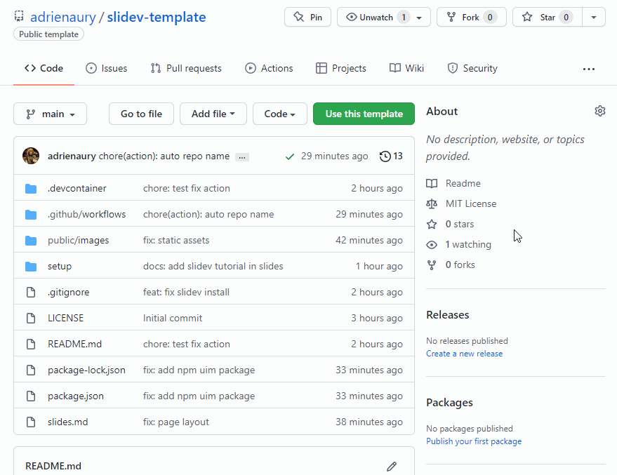
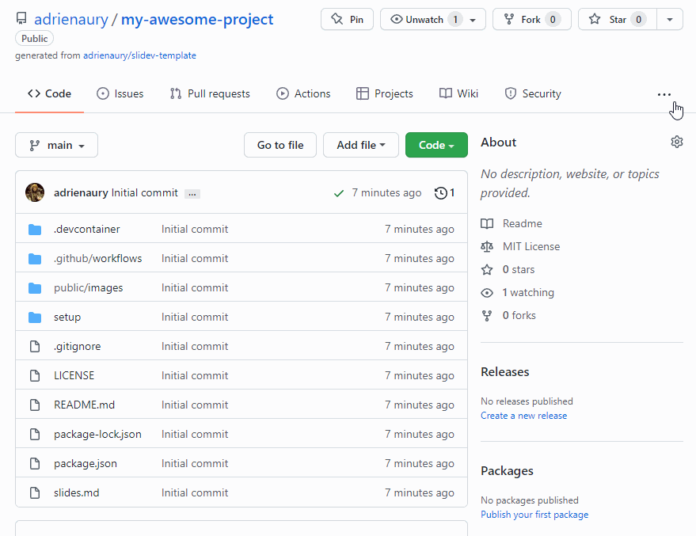

# SliDev Template

Features :

- A Fully configured [SliDev](https://sli.dev/) environment
- A GitHub action will automatically update your GitHub pages on every commit

See it in action : https://adrienaury.github.io/slidev-template

## How to use this template

First push the button `Use this template`



Then activate GitHub Pages



Finally check the website

Navigate to :

```
https://<your github user name>.github.io/<your repository name>
```

## How to edit and debug your slides

### Prerequisites

You need :

- Visual Studio Code ([download](https://code.visualstudio.com/)) with the [Remote - Containers extension](https://marketplace.visualstudio.com/items?itemName=ms-vscode-remote.remote-containers) installed.
- Docker Desktop (Windows, macOS) or Docker CE/EE (Linux)

Details are available on [the official Visual Studio documentation](https://code.visualstudio.com/docs/remote/containers#_getting-started).

### Run your workspace

When opening the folder with [Visual Studio Code](https://code.visualstudio.com/), the [Remote - Containers extension](https://marketplace.visualstudio.com/items?itemName=ms-vscode-remote.remote-containers) will detect the devcontainer configuration and ask you to reopen the project in a container.

Accept !

### Run slidev

From the VSCode terminal.

```console
$ slidev


  ●■▲
  Slidev  v0.29.2 

  theme   @slidev/theme-default
  entry   /workspaces/slidev-template/slides.md

  slide show      > http://localhost:3030/
  presenter mode  > http://localhost:3030/presenter
  remote control  > pass --remote to enable

  shortcuts       > restart | open | edit


```

Auto-reloaded slides will be on : http://localhost:3030/
