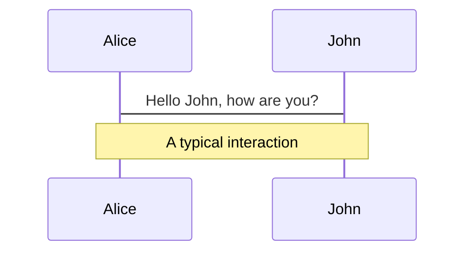

# Slidev

GitHub template demonstration

Use the <kbd>➡️ right arrow</kbd> or the <kbd>space bar</kbd> of your keyboard to navigate to next slide.

---

# How to use this template

First push the button `Use this template`


---

# How to use this template

Then activate GitHub Pages


---

# How to use this template

Finally check the website

Navigate to :

```
https://<your github user name>.github.io/<your repository name>
```

---

# Now you can make your first commit

Edit the file `slides.md` in your new repository.

The Slidev syntax is easy to learn, especially if you already know Markdown.

Check the official [Slidev Demo](https://demo.sli.dev/starter/).

And the [Markdown Syntax guide](https://sli.dev/guide/syntax.html).

---

# Code blocks

Directly use code blocks for highlighting

```ts
console.log('Hello, World!')
```

To highlight specific lines, simply add line numbers within bracket {}. Line numbers start counting from 1.

```go {5-7}
package main

import "fmt"

func main() {
	fmt.Println("Hello, 世界")
}
```

To change the highlight in multiple steps, you can use | to separate them. For example `{1|2|3}`

```java {1|2|3}
public class HelloWorld {
    public static void main(String[] args) {
        System.out.println("Hello, World");
    }
}
```

---

# Monaco Editor

Whenever you want to do some modification in the presentation

Simply add {monaco} after the language id — it turns the block into a fully-featured Monaco editor!

```ts {monaco}
console.log('HelloWorld')
```

---

# Embedded Styles

You can use `<style>` tag in your Markdown directly to override styles for the current slide.

Text on the current slide will be red.

```html
<style>
p {
  color: red
}
</style>
```

<style>
p {
  color: red
}
</style>

Next slide is not affected

---

# Static assets

Just like you would do in markdown, you can use images pointing to a remote or local url.

Put them into the public folder and reference them with leading slash.


If you want to apply custom sizes or styles, you can convert them to the `` tag

```html

```


---

# Notes

<!-- This is NOT a note because it precedes the content of the slide -->

You can also take notes for each slide.

They will show up in [Presenter Mode](/presenter) for you to reference during presentations.

<!--
This is a note
-->

---

# Icons

Slidev allows you to have the accessing to almost all the popular open-source iconsets directly in your markdown.

The naming follows Iconify's conversion {collection-name}-{icon-name}.

- `<mdi-account-circle />` : <mdi-account-circle /> from [Material Design Icons](https://github.com/Templarian/MaterialDesign)
- `<carbon-badge />` : <carbon-badge /> from [Carbon](https://github.com/carbon-design-system/carbon/tree/main/packages/icons)
- `<uim-rocket />` : <uim-rocket /> from [Unicons Monochrome](https://github.com/Iconscout/unicons)
- `<twemoji-cat-with-tears-of-joy />` : <twemoji-cat-with-tears-of-joy /> from [Twemoji](https://github.com/twitter/twemoji)
- `<logos-vue />` : <logos-vue /> from [SVG Logos](https://github.com/gilbarbara/logos)
- and much more ...

You can style the icons just like other HTML elements. For example:

<uim-rocket class="text-3xl text-orange-400 animate-ping" />

---

# Slots

Some layouts can provide multiple contributing points using Vue's named slots.

Check next slide for an example.

---
layout: two-cols
---

::right::

# Right

This shows on the right

::default::

# Left

This shows on the left

---

# Diagrams

Powered by Mermaid.



---

# And more

There is a lot of features not covered here.

Check the official [Slidev Demo](https://demo.sli.dev/starter/).

And the [Markdown Syntax guide](https://sli.dev/guide/syntax.html).

